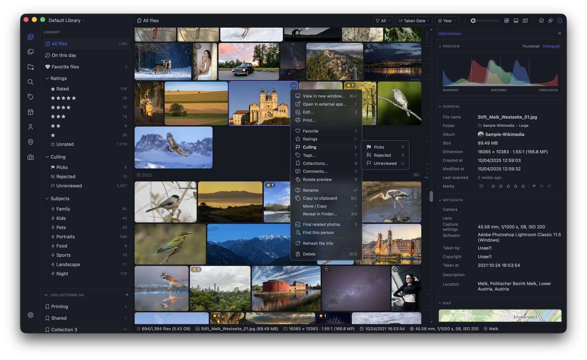
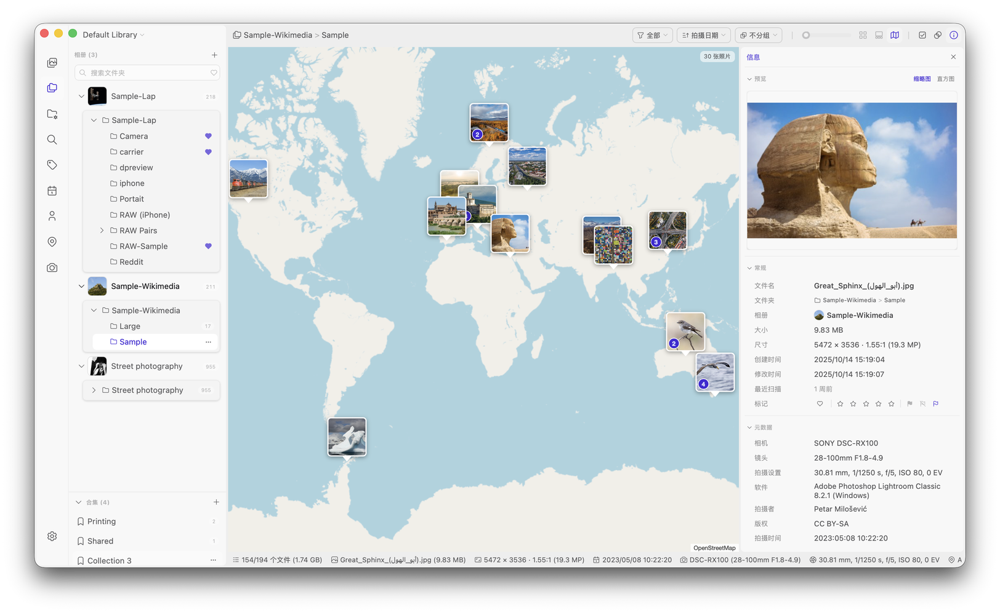

<div align="center">
  
  <h1>Lap — prywatny, lokalny menedżer zdjęć</h1>
  <h3>Darmowy menedżer zdjęć na komputery stacjonarne o otwartym kodzie źródłowym, dla systemów macOS, Windows i Linux.</h3>
  <p>
    <a href="https://github.com/julyx10/lap/releases"></a>
    <a href="https://github.com/julyx10/lap/releases"></a>
    <a href="https://github.com/julyx10/lap/stargazers"></a>
  </p>
</div>

[English](../README.md) | [Deutsch](README.de.md) | [Español](README.es.md) | [Français](README.fr.md) | [Italiano](README.it.md) | [Magyar](README.hu.md) | [Nederlands](README.nl.md) | Polski | [Português](README.pt.md) | [Русский](README.ru.md) | [Українська](README.uk.md) | [中文简体](README.zh-CN.md) | [中文繁體](README.zh-TW.md) | [日本語](README.ja.md) | [한국어](README.ko.md)

Lap to menedżer zdjęć o otwartym kodzie źródłowym, działający w modelu lokalnym (local-first), służący do przeglądania rodzinnych albumów, szybkiego wyszukiwania starych zdjęć i zarządzania dużymi osobistymi bibliotekami multimediów w trybie offline.
Jest to nastawiona na prywatność alternatywa dla chmurowych usług zdjęciowych: bez wymuszonego przesyłania, z lokalnym wyszukiwaniem AI, przepływem pracy opartym na folderach i bezpłatnym użytkowaniem.

## Pobierz Lap

Otwórz [stronę najnowszego wydania](https://github.com/julyx10/lap/releases/latest) i pobierz plik pasujący do Twojego systemu:

| Platforma | Pakiet | Uwaga |
| :-- | :-- | :-- |
| **macOS (Apple Silicon / Intel)** | `_aarch64.dmg` / `_x64.dmg` | Notaryzowany przez Apple |
| **Windows 10/11 (x64 / ARM64)** | `_x64_en-US.msi` / `_arm64_en-US.msi` | Niepodpisany — jeśli SmartScreen zablokuje pobieranie, kliknij **Zachowaj mimo to** |
| **Linux (x64 / ARM64)** | `_amd64.deb` / `_arm64.deb` | Dla dystrybucji opartych na Debianie (Ubuntu, Debian, Linux Mint itp.) |
| **Linux (x64 / ARM64)** | `_amd64.AppImage` / `_aarch64.AppImage` | Nadaj plikowi uprawnienie do wykonywania, a następnie uruchom go dwuklikiem |

### macOS z Homebrew

```bash
brew tap julyx10/lap
brew install --cask lap
```

## Zrzuty ekranu

<p align="center">
  
  
</p>

## Dlaczego Lap

- **Lokalny od podstaw**: Twoje zdjęcia pozostają na Twoim dysku, bez wymaganego konta chmurowego i przesyłania.
- **Bez uzależnienia od jednej biblioteki**: pracuj bezpośrednio na istniejących folderach zamiast importować wszystko do zamkniętej bazy danych.
- **Prywatne narzędzia AI**: wyszukiwanie, podobieństwo, inteligentne tagi i funkcje twarzy działają lokalnie na Twoim komputerze.
- **Stworzony dla dużych kolekcji**: zoptymalizowany pod kątem płynnego przeglądania i porządkowania bibliotek liczących ponad 100 tys. plików.
- **Otwarty kod źródłowy i bezpłatność**: bez subskrypcji, bez wymuszonego ekosystemu i z kodem, który możesz przejrzeć.

## Funkcje

- **Elastyczne przeglądanie biblioteki** według daty, folderu, lokalizacji, aparatu, obiektywu, tagów, ocen i twarzy, z sortowaniem losowym i filtrem małych zdjęć.
- **Interaktywny widok mapy** do eksplorowania zdjęć i filmów z geotagami w klastrach zgodnych z bieżącymi filtrami.
- **Inteligentne albumy** zapisują widoki oparte na regułach z niestandardowym grupowaniem i sortowaniem.
- **Kolekcje i tagi** do masowego porządkowania wybranych plików bez przenoszenia lub duplikowania oryginałów.
- **Lokalne wyszukiwanie AI** dla zapytań tekstowych, podobieństwa wizualnego, tematów, grupowania twarzy oraz opcjonalnego wyszukiwania wielojęzycznego w ponad 50 językach.
- **Apple Live Photos i Google Motion Photos** z odtwarzaniem ruchu oraz ujednoliconym filtrem inteligentnych albumów.
- **Pary RAW + JPEG/HEIC** wyświetlane jako jeden element, z powiązanymi plikami utrzymywanymi razem podczas operacji na plikach.
- **Konfigurowalne miniatury i podglądy RAW** przy użyciu renderowania RAW lub osadzonego podglądu z aparatu.
- **Praca oparta na folderach** z wieloma bibliotekami, importem przez przeciąganie i upuszczanie, importem przez kopiowanie-wklejanie, synchronizacją z systemem plików oraz bezpiecznymi operacjami przenoszenia/kopiowania/usuwania.
- **Import z organizacją wg dat** z układami dziennym, miesięcznym, rocznym lub jednym folderem, oryginalnymi nazwami plików i pomijaniem duplikatów.
- **Narzędzia selekcji i porównywania**, w tym przeglądarka porównania obrazów w czterech panelach.
- **Czyszczenie duplikatów** z podsumowaniami odzyskiwanej przestrzeni i masowym usuwaniem w zbiorach duplikatów.
- **Konfigurowalne wyświetlanie** z miniaturami do 1024 px, regulowanymi rozmiarami i narożnikami siatki oraz szybkim podglądem lub oddzielnymi oknami przeglądarki.
- **Integracja z pulpitem** z wieloma aplikacjami zewnętrznymi i wyborem tapety w systemach macOS, Windows i GNOME Linux.
- **Wbudowana edycja** do kadrowania, obracania, odbijania, zmiany rozmiaru i podstawowych korekt zdjęć.
- **Szeroka obsługa formatów** — ponad 60 formatów zdjęć, RAW i wideo.

## Metadane, kolekcje i przenoszenie plików

Lap jest oparty na folderach, ale nie każda informacja wyświetlana w Lap jest osadzona w oryginalnym pliku. To rozróżnienie ma znaczenie, jeśli tymi samymi folderami zarządzasz również w Finderze, Eksploratorze lub innej aplikacji zdjęciowej.

### Co pozostaje z plikiem

- Twoje oryginalne zdjęcia i filmy są zawsze zwykłymi plikami w istniejących folderach.
- Metadane już osadzone w pliku, takie jak data wykonania EXIF, aparat, obiektyw, GPS i orientacja, są odczytywane z tego pliku podczas indeksowania przez Lap.
- Zapisanie edycji wykonanej wbudowanym edytorem zapisuje wynikowy obraz do wybranego miejsca docelowego.
- Gdy zmieniasz nazwę, przenosisz, kopiujesz lub usuwasz pliki **w Lap**, Lap aktualizuje jednocześnie swój lokalny katalog. Utrzymuje też razem obsługiwane powiązane zasoby, takie jak składniki Apple Live Photo, pliki towarzyszące AAE oraz włączone pary RAW + JPEG/HEIC.

### Co Lap przechowuje lokalnie

Poniższe elementy to dane biblioteki Lap. Są przechowywane w lokalnej bazie danych lub konfiguracji biblioteki Lap, a nie zapisywane w plikach EXIF, IPTC ani XMP:

- Kolekcje, tagi, komentarze, ulubione, oceny i stany selekcji (w tym wybrane i odrzucone)
- Inteligentne albumy wraz z ich regułami, grupowaniem, sortowaniem i kolejnością
- Dane wyszukiwania AI, dane twarzy, miniatury oraz inne dane indeksów/cache

Te dane nie podążają za plikiem, gdy jest on kopiowany, eksportowany lub przenoszony poza Lap, i nie są automatycznie dostępne dla innych aplikacji.

### Praca z plikami poza Lap

Lap może ponownie skanować foldery i wykrywać wiele zmian w systemie plików. Jednak zmiany dokonane poza Lap — takie jak zmiana nazwy, przenoszenie, zastępowanie lub kopiowanie plików — mogą zakłócić porządek przechowywany wyłącznie w Lap.

Aby uzyskać najbardziej niezawodne rezultaty, zmieniaj nazwy i przenoś pliki w Lap, gdy polegasz na kolekcjach, tagach, komentarzach, ulubionych, ocenach lub stanach selekcji. Jeśli zarządzasz plikami również poza Lap, twórz kopie zapasowe bazy danych i konfiguracji Lap razem ze zdjęciami. Lokalizacją bazy danych możesz zarządzać, a kopię zapasową utworzyć w **Ustawienia → Przechowywanie**.

Usunięcie bazy danych lub konfiguracji Lap usuwa te lokalne dane porządkowania i indeksów, ale nie usuwa oryginalnych plików multimedialnych.

## Odinstaluj Lap

Lap działa bezpośrednio na istniejących folderach ze zdjęciami. Odinstalowanie Lap lub usunięcie jego bazy danych i plików cache **nie usuwa** Twoich oryginalnych zdjęć.

Standardowe kroki odinstalowania usuwają aplikację. Aby usunąć Lap całkowicie, najpierw zakończ działanie Lap, odinstaluj aplikację, a następnie usuń jej lokalną bazę danych, cache miniatur i pliki konfiguracyjne, używając polecenia czyszczącego dla Twojej platformy.

### macOS

Jeśli zainstalowałeś Lap przez Homebrew:

```bash
brew uninstall --cask lap
```

W przypadku instalacji ręcznej zakończ działanie Lap i przenieś `Lap.app` z folderu `Applications` do Kosza.

Aby usunąć wszystkie pliki bazy danych, cache i konfiguracji Lap:

```bash
rm -rf "$HOME/Library/Application Support/com.julyx10.lap" \
       "$HOME/Library/Caches/com.julyx10.lap" \
       "$HOME/Library/WebKit/com.julyx10.lap"
rm -f "$HOME/Library/Preferences/com.julyx10.lap.plist"
```

### Windows

Otwórz **Ustawienia > Aplikacje > Zainstalowane aplikacje**, znajdź **Lap** i wybierz **Odinstaluj**.

Następnie otwórz PowerShell i usuń wszystkie pliki bazy danych, cache i konfiguracji Lap:

```powershell
Remove-Item -Recurse -Force -ErrorAction SilentlyContinue "$env:LOCALAPPDATA\com.julyx10.lap"
Remove-Item -Recurse -Force -ErrorAction SilentlyContinue "$env:APPDATA\com.julyx10.lap"
```

### Linux

W przypadku instalacji z pakietu DEB odinstaluj pakiet:

```bash
sudo apt remove lap
```

W przypadku instalacji AppImage zakończ działanie Lap i usuń pobrany plik `.AppImage`.

Następnie usuń wszystkie pliki bazy danych, cache i konfiguracji Lap:

```bash
rm -rf "$HOME/.local/share/com.julyx10.lap" \
       "$HOME/.cache/com.julyx10.lap" \
       "$HOME/.config/com.julyx10.lap"
```

Jeśli w ustawieniach Lap wybrałeś niestandardowy katalog przechowywania bazy danych, usuń ten katalog osobno po upewnieniu się, że zawiera wyłącznie pliki bazy danych Lap.

## Budowanie ze źródeł

Wymagania: Node.js 20+, pnpm, Rust w wersji stabilnej.

```bash
# Zależności systemowe macOS
xcode-select --install
brew install nasm pkg-config autoconf automake libtool cmake

# Zależności systemowe Linux
# sudo apt install libwebkit2gtk-4.1-dev libappindicator3-dev librsvg2-dev \
#   patchelf nasm clang pkg-config autoconf automake libtool cmake

# Klonowanie i budowanie
git clone --recursive https://github.com/julyx10/lap.git
cd lap
git submodule update --init --recursive
cargo install tauri-cli --version "^2.0.0" --locked
./scripts/download_models.sh            # Windows: .\scripts\download_models.ps1
./scripts/download_ffmpeg_sidecar.sh    # Windows: .\scripts\download_ffmpeg_sidecar.ps1
cd src-vite && pnpm install && cd ..
cargo tauri dev
```

Pakiety dystrybucyjne mogą linkować z systemową biblioteką libheif (1.17 lub nowszą) zamiast z dołączonymi libheif i libde265. Ustaw `LAP_SYSTEM_LIBHEIF=1` na czas budowania. Wówczas podmoduły `third_party/libheif` i `third_party/libde265` nie są potrzebne. Dekodowanie HEVC zależy od wtyczek kodeków systemowej biblioteki libheif.

## Obsługiwane formaty

Lap obsługuje ponad 60 formatów zdjęć, RAW i wideo.

| Typ | Formaty |
| :-- | :-- |
| Obrazy | JPG/JPEG/JFIF, PNG, GIF, BMP, TIFF, WebP, HEIC/HEIF/HIF, AVIF, JXL, PSD, EXR, HDR/RGBE, TGA, JPEG 2000 (JP2/J2K/J2C/JPC/JPF/JPX), DDS, DPX, QOI |
| Zdjęcia RAW | CR2, CR3, CRW, NEF, NRW, ARW, SRF, SR2, RAF, RW2, ORF, PEF, DNG, SRW, RWL, MRW, 3FR, MOS, DCR, KDC, ERF, MEF, RAW, MDC |
| Filmy | MP4, MOV, M4V, MKV, AVI, FLV, TS/M2TS, WMV, WebM, 3GP/3G2, F4V, VOB, MPG/MPEG, ASF, DIVX i inne. Odtwarzanie H.264 jest obsługiwane na wszystkich platformach, z automatycznym przetwarzaniem zgodności, gdy natywne odtwarzanie jest niedostępne. HEVC/H.265 i VP9 są natywnie obsługiwane w systemie macOS. |

### Odtwarzanie wideo w Linuksie

Lap używa systemowych wtyczek GStreamer do odtwarzania wideo, również w AppImage. Jeśli filmy nie odtwarzają się w Ubuntu, Debianie lub Linux Mint, zainstaluj:

```bash
sudo apt install gstreamer1.0-libav gstreamer1.0-plugins-good
```

## Architektura

- Core: Tauri + Rust
- Frontend: Vue + Vite + Tailwind CSS
- Baza danych: SQLite

### Kluczowe biblioteki

| Biblioteka | Przeznaczenie |
| :-- | :-- |
| [LibRaw](https://github.com/LibRaw/LibRaw) | Dekodowanie zdjęć RAW i wyodrębnianie miniatur |
| [libheif](https://github.com/strukturag/libheif) | Dekodowanie obrazów HEIC/HEIF/HIF i generowanie podglądów |
| [libjpeg-turbo](https://libjpeg-turbo.org/) | Szybkie dekodowanie JPEG i generowanie miniatur |
| [FFmpeg](https://ffmpeg.org/) | Przetwarzanie wideo i generowanie miniatur |
| [Video.js](https://videojs.com/) | Międzyplatformowy interfejs odtwarzania wideo |
| [ONNX Runtime](https://onnxruntime.ai/) | Lokalny silnik wnioskowania modeli AI |
| [CLIP](https://github.com/openai/CLIP) | Wyszukiwanie podobieństwa obraz–tekst |
| [InsightFace](https://github.com/deepinsight/insightface) | Wykrywanie i rozpoznawanie twarzy |
| [Leaflet](https://leafletjs.com/) | Interaktywna mapa dla zdjęć z geotagami |
| [daisyUI](https://daisyui.com/) | Biblioteka komponentów interfejsu |

## Licencja

GPL-3.0-or-later. Zobacz [LICENSE](../LICENSE).

## Prywatność

Przeczytaj [Politykę prywatności](../PRIVACY.md), aby poznać szczegóły dotyczące przetwarzania danych i opcjonalnych usług online.
